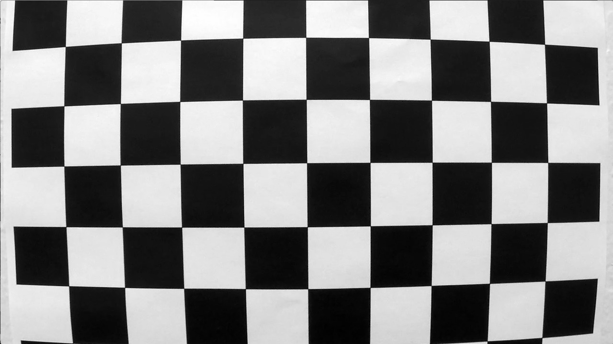
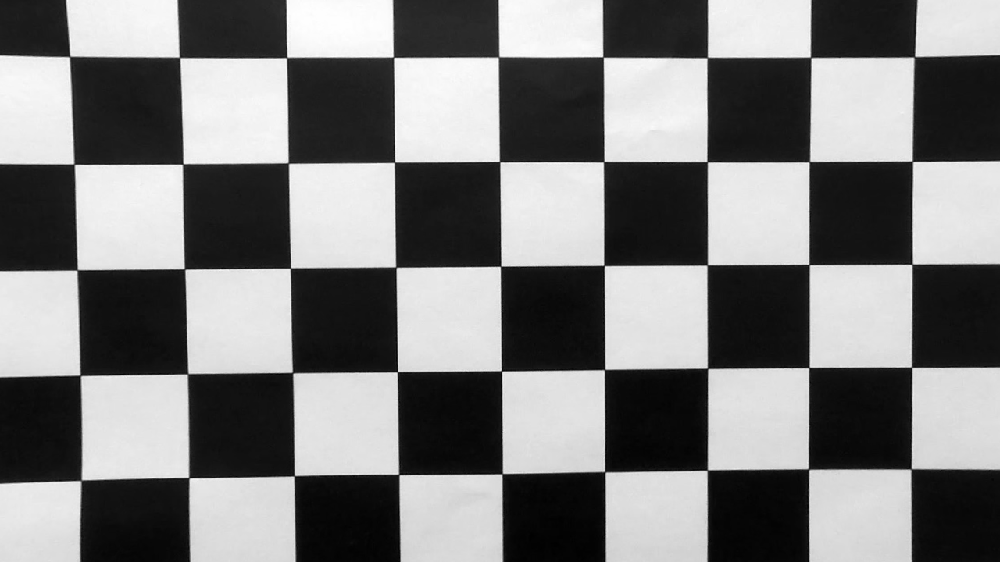
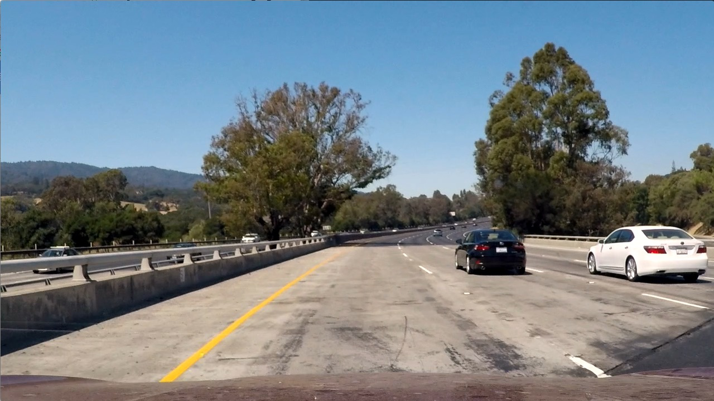
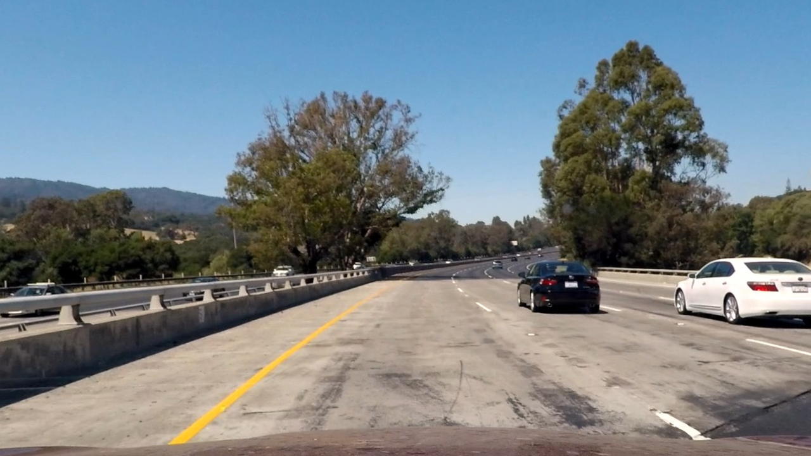
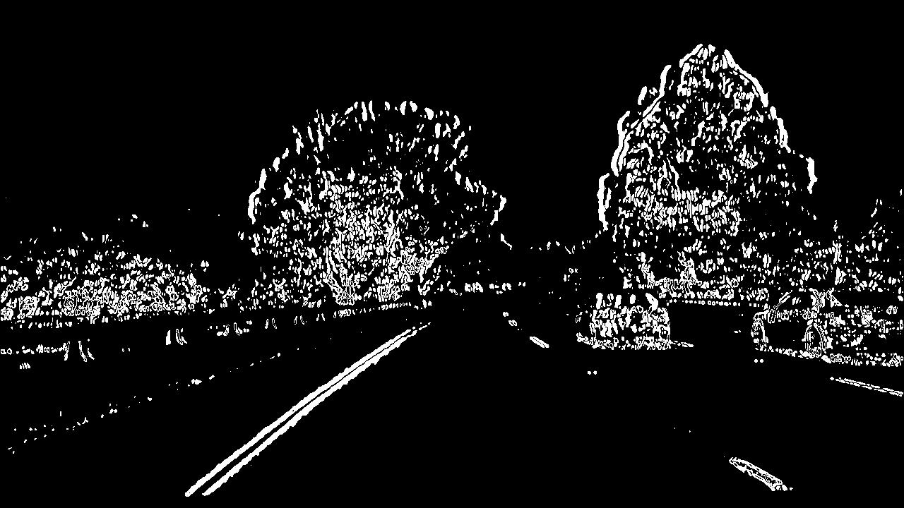
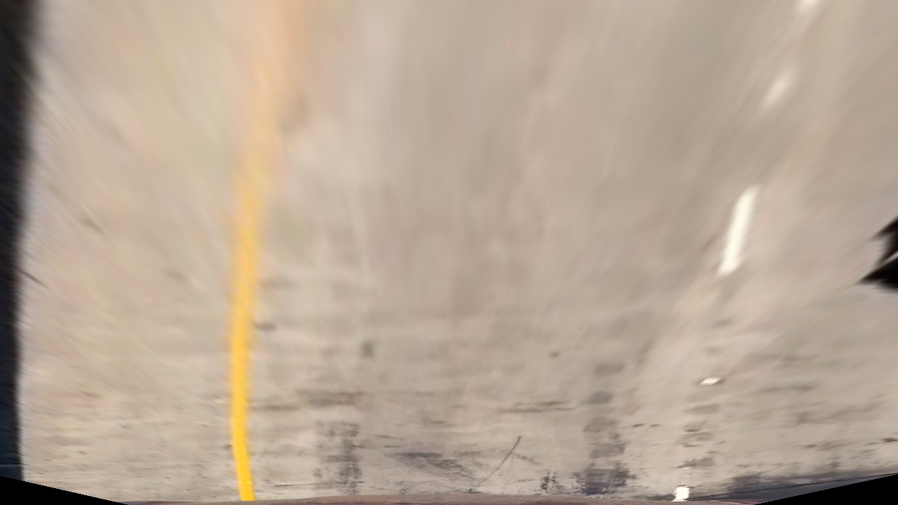
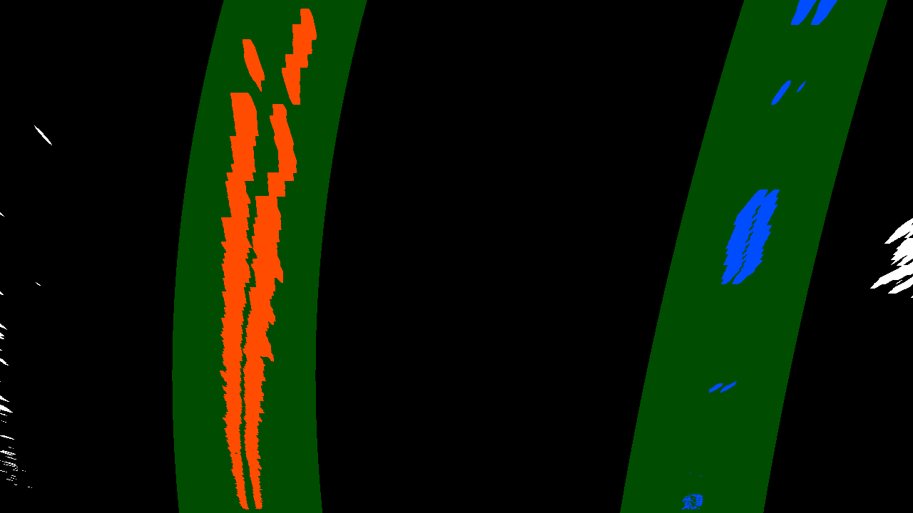
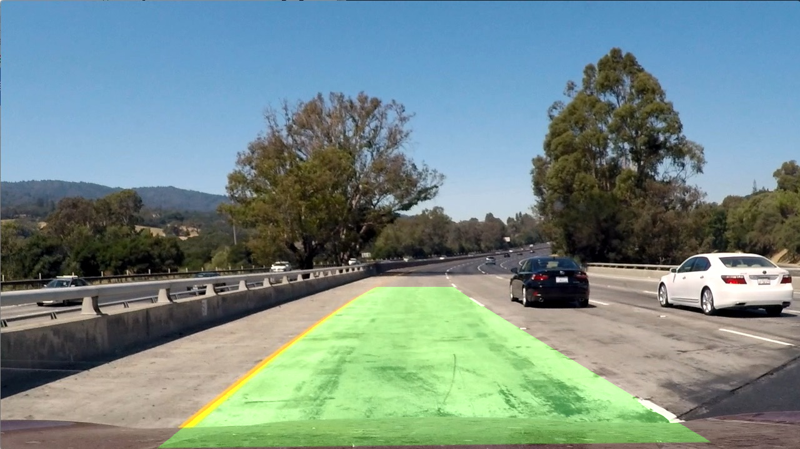

# Advanced Lane Finding

### The goals / steps of this project are the following:
##### 1) Calibrate the camera and get camera matrix and distortion coefficients
##### 2) Using camera matrix and distortion coefficients get undistorted image
##### 3) On undistorted images apply color transform and/or gradient to extract lanes features and get binary image which should mostly contain lanes features.
##### 4) Do perspective transform on the binary image to get bird eye view. Let’s call resulting image binary wrapped image
##### 5) Use histogram and sliding window technique on binary wrapped image to get lane pixels.
##### 6) find best fit second-degree polynomial to fit left and right lane lines pixels.
##### 7) Transform detected left and right lane lines to original image.
##### 8) from left and right line curves, find average radius of curvature.
##### 9) assuming camera is centered in the image find car position with in the lane.

### rubric point 1 Camera Calibration
###### 1) read all the calibration images
###### 2) for each one find corners, append them in a list. (calling image points).
###### 3) for each image append object points in a list. (calling object points, same for all callibration images)
###### 4) using object points and image points, call cv2.calibrateCamera function to get camera matrix and distortion coefficients
###### 5) now use cv2.undistort function to get undistorted image
###### 6) plot it

Gray Original Image                         |  Gray undistorted Image
:------------------------------------------:|:------------------------------------:
  |  

## Pipeline (test images)
### Rubric point 2 (Provide an example of a distortion-corrected image.)
###### 1) using camera matrix and distortion coefficients, call cv2.undistort function to get undistorted image
###### 2) plot it.

RGB Image                                         |  undistorted Image
:------------------------------------------------:|:------------------------------------:
  |  

### Rubric point 3 (getting binary image using color transforms and gradients)
###### 1) get r,g,b and h,l,s images
###### 2) s and r value image is found to be more suitable, so it is used to detect yellow and white lane lines.
###### 3) get sobel X gredient for both S and R images and OR them. This is the final binary image which contains lane features

undistorted Image                                    |  binary image
:---------------------------------------------------:|:------------------------------------:
  |  

### Rubric Point 4 perspective transform 
###### 1) using cv2.getPerspectiveTransform get perspective_transform matrix
###### 2) choose source points (4) in original image and destination points (4) in resulting image to get birds eye view image.
###### 3) apply perspective transform matrix and plot resulting image

undistorted Image                                    |  transformed image
:---------------------------------------------------:|:------------------------------------:
  |  

### Rubric Point 5 (Identify lane-line pixels and fit their positions with a polynomial)
###### 1) First apply bird eye view transform to binary image that we got in previous steps.
###### 2) Call find_laen_lines_wrapped function to get left/right_fit polynomials with left/right_fit_X/Y pixels. 
###### 3) To plot resulting lane line polynomials and pixels, create 3d image from binary_wrapped_image, using np.dstak
###### 4) for every Y pixel value, get X pixel value from left and right polynomials
###### 5) Add margin(100) around these pixels and draw them in green color
###### 6) draw left/right_fit_x/y pixels also which we got from sliding window technique

### Rubric Point 6 (curvature of the lane and the position of the vehicle)
###### 1) From previous step we have left/right_fit_x/y pixels (sliding window technique)
###### 2) But these lane points are in pixel space. So they are converted to real world space and different polynomial was fitted for them.
###### 3) from polynomial coefficients calucate the left and right radius of curvature. print the average result.
###### 4) Assuming camera is centered in the image, So middle X pixel (column) of the whole image is the position of the car.
###### 5) Get bottom left/right X pixel for left/right lane lines
###### 6) Get middle of the lane X pixel value
###### 7) Differenec between 4 and 6 is car position in the lane, But it is in pixels. 
###### 8) Assuming lane width is 3.7 meters and lane is spread to 700 pixels then we can convert pixel to cm by multiplying 370/700 factor
###### 9) print car position in cm

### Rubric Point 7 (result plotted back and lane area is identified clearly)
###### 1) From the previous step we already have all the information about left and right lines.
###### 2) call the function project_lanes_back()
###### 3) This function gets X pixel values for every Y pixel (zero to the size) from left_fit/right_fit polynomial, and draws it green.
###### 4) Finally It combines original image with drawn lanes image(previous step) to get resulting output.

# Pipeline (video
### Rubric Point 8 (Pipeline (video))
###### 1) Created an object of Line class to store left and right line information among differeent iteration of the video.
###### 2) Call the pipe line function (find_lane_pipe_line) for each image of the video
###### 3) Save newly created video with file name project_video_output.mp4

![video_output]: (./project_video_output.mp4)